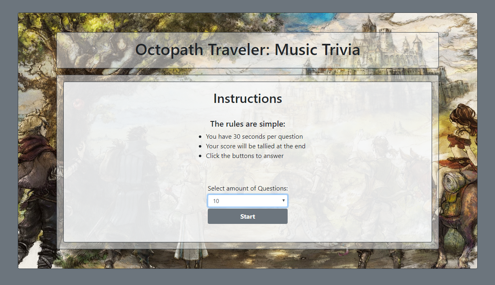

# Octopath Traveler: Music Trivia

## Summary
A trivia game that plays random music tracks for the player to guess the correct song title. It utilizes jQuery/JS to plug in answer buttons and music. 

### **Highlights:**
- Song List is read from a json file and stored in an object array
- Pulls song information from an array to randomly generate questions with answer buttons
- Timers set for limiting time spent on a question. And, timer before asking the next question
- Swap function!

## Technologies Used
- HTML
- Bootstrap
- Javascript/jQuery
- CSS
- Git
- GitHub
- VSCode

## Goals
- Find a way to match countdown timer to audio timer
- ~~Fill the songs array by reading from a file~~
- Find a way to hide source audio src paths

## Site Picture


## Code Snippet
I chose these lines of code because they highlight the most recent things I've learned

```
// set a timer for guessing the answer!
function beginCountdown() {
    var timer = 30;
    $("#timer").html("Time Left: " + timer + " seconds");
    // create a countdown interval
    intervalId = setInterval(function() {
        timer--;
        $("#timer").html("Time Left: " + timer + " seconds");
        // if timer reaches 0
        if (timer === 0) {
            // then stop countdown
            clearInterval(intervalId);
            // hide buttons
            hideButtons();
            // update info text
            infoText("Time's up! The correct answer is <strong>" + answer + "</strong>")
            // stop the song!
            stopSong();
            // get ready for next song!
            setTimeout(queueQuestion, 5000);
        }
    }, 1000);
}

// function to shuffle an array
function shuffle(array) {
    // use a for loop in reverse!
    for (var i = array.length - 1; i > 0; i--) {
        // create a random number based on i
        var num = Math.floor(Math.random() * (i + 1));
        // store array index in temp
        var temp = array[i];
        // do a shuffle
        array[i] = array[num];
        array[num] = temp;
    }
    return array;
}

// generate false song titles
function falseTitles(songTitle) {
    // get answer title index #
    var a = songs.findIndex(songs => songs.title === songTitle);
    // declare variables to store false titles give them a value so they're defined for if comparisons later
    var b = "A",
        c = "A",
        d = "A";
    var boolKey = true;

    // loop until b c d has different index numbers that are not the same
    while(boolKey) {
        // stop while loop if there's no reason to loop again
        boolKey = false;
        // generate random number
        var num = Math.floor(Math.random() * songs.length);
        // check if num = a, b, or c
        if (num === a || num === b || num === c) {
            // change boolkey to loop again for a new number
            boolKey = true;
        }
        // if b is empty
        else if (b === "A") {
            // store number in b
            b = num;
            boolKey = true;
        }
        // if b is not empty, but c is
        else if (b !== "A" && c === "A") {
            // store number in c
            c = num;
            boolKey = true;
        }
        // store in d if anything else
        else {
            d = num;
        }
    }

    // now get the titles
    a = getSongTitle(a);
    b = getSongTitle(b);
    c = getSongTitle(c);
    d = getSongTitle(d);

    // shove the titles into an array and return it
    var array = [a, b, c, d];

    return array;
}
```
## Links
Live Page: https://seiretsym.github.io/TriviaGame<br>
Repo: https://github.com/seiretsym/TriviaGame<br>
LinkedIn: https://www.linkedin.com/in/kerwinhy/<br>
GitHub: https://github.com/seiretsym<br>